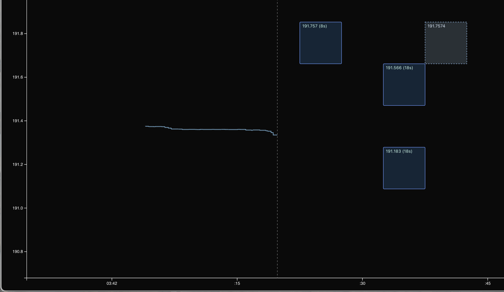

# Trading Arcade Game - Drift Perpetuals



### Box Lifecycle
```
Preview → Pending → Open → TP Hit / Liquidated / Expired
```

1. **Preview**: User drags on chart to preview box
2. **Pending**: Transaction submitted to blockchain
3. **Open**: Position created, TP limit order placed
4. **TP Hit**: Take profit reached, position closes automatically
5. **Liquidated**: Price moved against position beyond margin
6. **Expired**: Arcade mode timer expired (closes at market)

### Payout Calculation
```
Payout Multiple = (Margin + Net PnL) / Margin
```
- Accounts for actual Jupiter Perps fees
- Real-time funding rate accumulation
- Price impact based on position size
